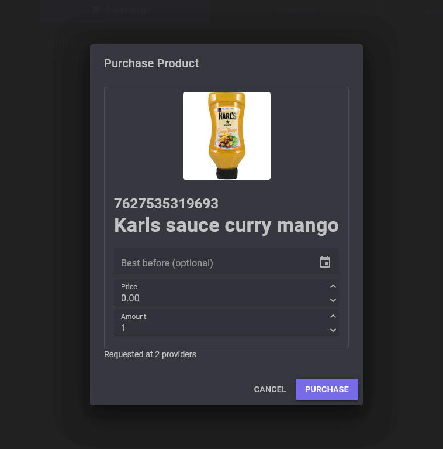
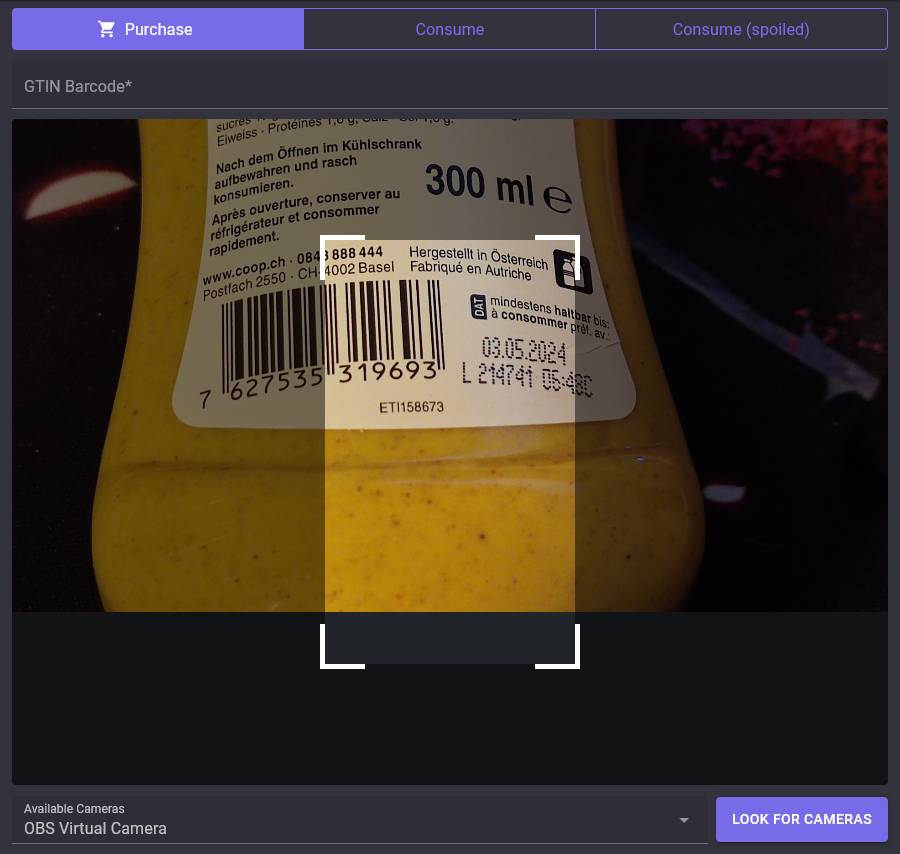

<div align="center">
    <h1>Grocy Scanner</h1>
    <h4>Lazy version of <a href="https://github.com/Forceu/barcodebuddy">Barcodebuddy</a></h4>
</div>

## About and Motivation
Scan EAN8 / EAN16 barcodes on your products with a camera (or a barcode reader) and add them to your [Grocy](https://grocy.info) in one click.
This is heavily inspired from [barcodebuddy](https://github.com/Forceu/barcodebuddy).
The key difference is how Grocy Scanner is handling products. It will never ask you to  map it to an existing product or manually create it, but create it automatically for you in Grocy or update their stock.

Grocy Scanner uses a list of crowd-sourced and proprietary lists from retailers to lookup barcodes.
It was written to recognize products for the most popular retailers in Switzerland, but may find products from retailers in other countries as well.

It's automatic algorithm analyzes the data and chooses the data with the highest quality.

## Screenshots





## Available Providers

- https://migros.ch
- https://coop.ch
- https://ch.openfoodfacts.org/

## Installation
### Docker Compose
```yaml
version: '3'
services:
  grocy-scanner:
    container_name: grocy-scanner
    image: ghcr.io/manuel-rw/grocy-scanner:latest
    restart: always
    environment:
      - "Grocy__BaseUrl=<YOUR-GROCY-HOST>"
      - "Grocy__ApiKey=<YOUR-API-KEY>"
    ports:
      - '7575:80'
```
Application will start on http://your-hostname:7575

### TrueNAS
- Add the TrueCharts catalog: https://truecharts.org/manual/intro
- Search for ``Custom App``in the catalog (not the TrueNAS custom app)
- Click on Install
- Enter ``ghcr.io/manuel-rw/grocy-scanner`` as the repository
- Enter ``latest`` as the container tag
- Scroll to "Extra environment variables"
  - Add ``Grocy__BaseUrl`` and set it's value to your Grocy URL
  - Add ``Grocy__ApiKey`` and set it to your API token
- Scroll to "Networking and services", select http as the type and enter 80 for both target and port.
- (Optional): Set up ingress
- Scroll to the bottom and click "Install"

## Notes
- Retailers can rate limit or drop your request depending on your country and amount of requests.
Please ensure fair usage of these resources. Grocy Scanner already tries to minimize requests as much as possible.
- This application does and will never support products without EAN8/13 barcode.